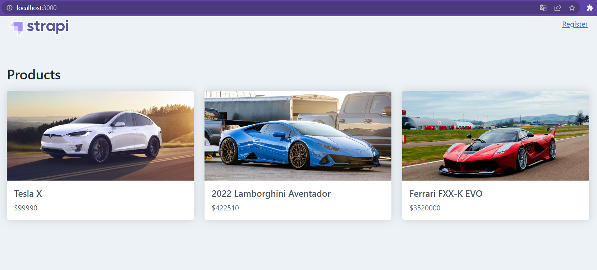

# Strapi App

Stack used: `Typescript, React, Redux, Strapi Api`

Implemented features: `register, login, get cart, add to cart, remove from cart, get products, product page`

> Frontend created completely from scratch

## Preview

> The functional with the cart will work after logging into account

## Development (locally)

Copy the repository and open the project folder in two terminals.

### Installing Backend

1. In the folder `ecommerce-backend` run the command `npm i`

2. Starting the server `npm run develop`

Admin Panel account credits:

- `admin-mail@gmail.com`
- `Test545454`

### Installing Frontend

1. In the folder `ecommerce-frontend` run the command `npm i`. (If not working, then `npm i --legacy-peer-deps`)

2. `npm run start`

Test User account credits:

- `test@davvv.com`
- `12345`

 

The Frontend server will run here => http://localhost:3000

The Strapi backend server will run here => http://localhost:1337

> If you have any questions or the project does not start, then write to me by mail
